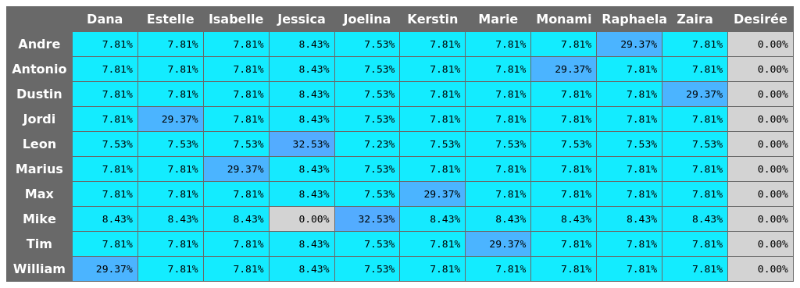
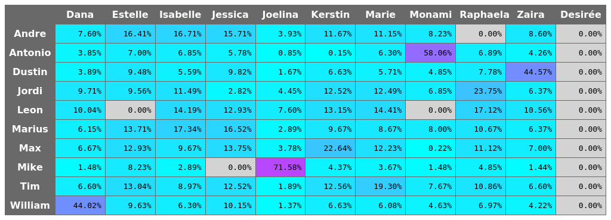
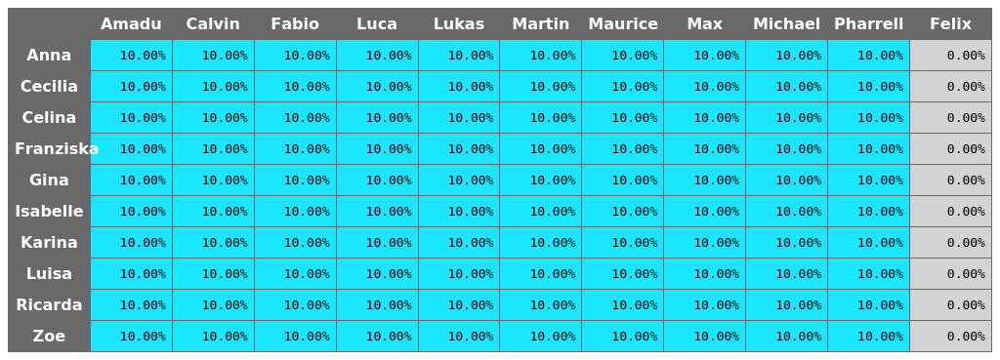
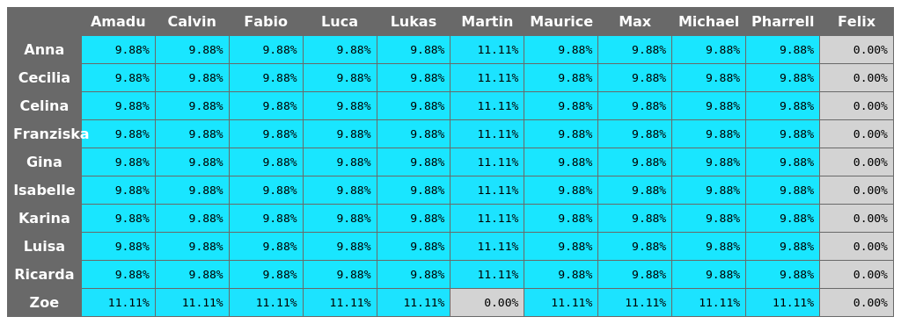
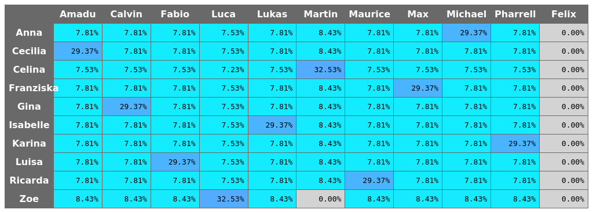
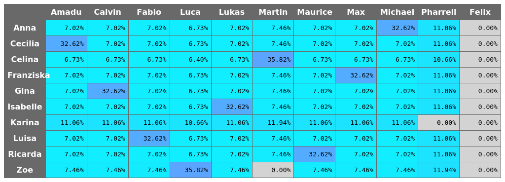

# AYTO Probabilities

This program computes probabilities for the (German) reality tv show "Are You The One".

Probabilities are based on "Match Night" and "Match Box" results.

## Results of previous seasons
Results listed below refer to the German seasons.

"AYTO VIP" is actually "Are You The One: Reality stars in love"

### AYTO - Season 3
In this season "Match Night" results and "Match Box" results are released in the same episode every two episodes.

#### Episode 0 (before season start)

#### Episode 2

#### Episode 4

#### Episode 6

#### Episode 8

#### Episode 8

#### Episode 10

#### Episode 12

#### Episode 14

### AYTO VIP - Season 2
In this season "Match Night" results and "Match Box" results are released in different episodes within a two episode cycle.

#### Episode 0 (before season start)

#### Episode 3 (Match Box result)

#### Episode 4 (Match Night result)

#### Episode 5 (Match Box result)

#### Episode 6 (Match Night result)
